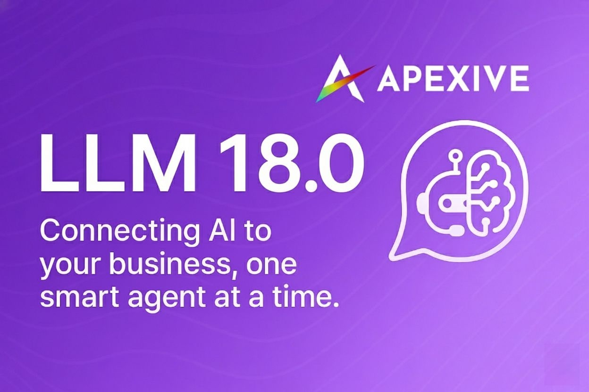
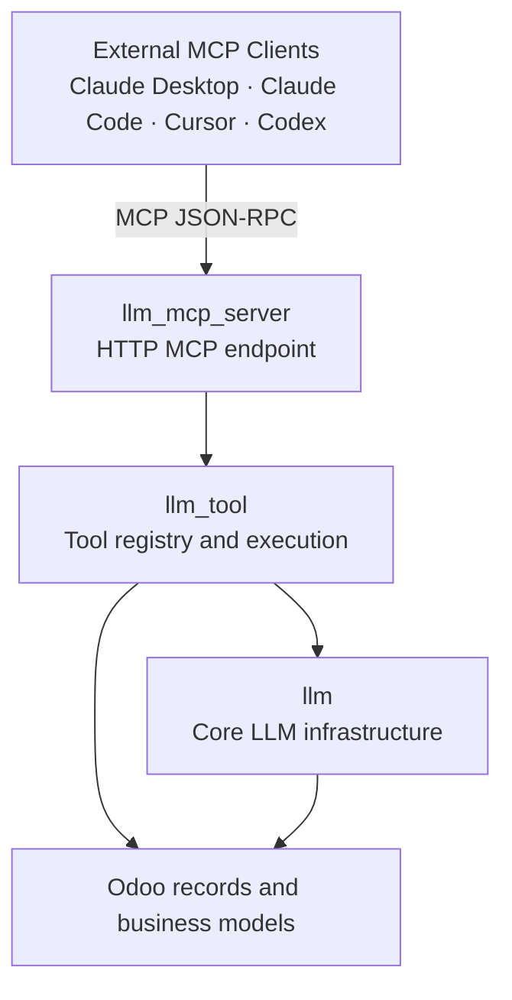

# Odoo LLM Integration



This repository provides Odoo modules for connecting Large Language Model workflows to Odoo data, tools, and external AI clients.

## Odoo 19.0 Porting Branch Status

The `19.0-porting` branch is a focused Odoo 19.0 Community porting branch. It contains the base MCP stack plus the provider, training, and domain tool modules ported in the current batch:

| Module | Version | Purpose |
| --- | --- | --- |
| `llm` | 19.0.1.0.0 | Core provider/model registry, publisher tracking, security groups, and LLM-specific mail message fields. |
| `llm_tool` | 19.0.1.0.0 | Tool framework, tool registry, generic CRUD tools, consent configuration, and MCP-safe access rules. |
| `llm_mcp_server` | 19.0.1.0.0 | HTTP MCP server exposing Odoo tools to Claude Desktop, Claude Code, Cursor, Codex, and other MCP clients. |
| `llm_openai` | 19.0.1.0.0 | OpenAI provider integration with chat, embeddings, multimodal messages, audio input, and fine-tuning hooks. |
| `llm_anthropic` | 19.0.1.0.0 | Anthropic Claude provider integration with chat, tool calls, and multimodal message formatting. |
| `llm_mistral` | 19.0.1.0.0 | Mistral provider integration through the OpenAI-compatible provider layer. |
| `llm_ollama` | 19.0.1.0.0 | Ollama provider integration for local chat models and tool calls. |
| `llm_training` | 19.0.1.0.0 | Fine-tuning dataset and training job management helpers. |
| `web_json_editor` | 19.0.1.0.0 | JSON field widgets used by training datasets and related configuration screens. |
| `llm_tool_account` | 19.0.1.0.0 | Accounting analysis and transaction tools for LLM tool execution. |
| `llm_tool_mis_builder` | 19.0.1.0.0 | MIS Builder reporting, KPI, period, style, and annotation tools. |
| `llm_tool_website` | 19.0.1.0.0 | Website content, menu, media, redirect, SEO, visitor, and configuration tools. |

Use the `18.0` branch if you need the complete module suite while the remaining addons are being ported.

## Architecture



This branch now covers external AI tool access through MCP, core text/chat providers, fine-tuning helpers, and the first domain tool packs. In-Odoo chat, assistants, RAG, vector stores, image/media generation, queued generation jobs, and business integrations are still pending ports.

## Not Yet Ported to 19.0

These modules exist on `18.0` but are not present on this 19.0 porting branch yet.

| Area | Modules | Summary |
| --- | --- | --- |
| Chat, prompts, and UI | `llm_thread`, `llm_assistant` | Chat client actions, assistant configuration, prompt templates, and related-record chat UX. |
| Image and media providers | `llm_replicate`, `llm_fal_ai`, `llm_comfyui`, `llm_comfy_icu` | Image/media generation providers and schema handling. |
| Knowledge and RAG | `llm_knowledge`, `llm_tool_knowledge`, `llm_knowledge_automation`, `llm_knowledge_llama`, `llm_knowledge_mistral` | Knowledge collections, document processing, RAG retrieval, automation, LlamaIndex, and Mistral OCR flows. |
| Vector stores | `llm_store`, `llm_pgvector`, `llm_chroma`, `llm_qdrant` | Vector store abstraction and backend integrations. |
| Generation | `llm_generate`, `llm_generate_job` | Unified content generation and queued generation jobs. |
| Remaining domain tool packs | `llm_tool_ocr_mistral`, `llm_tool_demo` | OCR tools and demo tools. |
| Business integrations | `account_invoice_import_llm`, `llm_document_page`, `llm_letta` | Invoice OCR import, document page integration, and Letta agent integration. |

Porting PRs should target `19.0` and add only modules that install and update cleanly on Odoo 19.0 Community.

## Installation

Requirements:

- Odoo 19.0 Community
- Python dependencies from `requirements.txt`
- PostgreSQL supported by Odoo 19.0

Install the MCP stack:

```bash
odoo-bin -d your_db -i llm_mcp_server
```

Odoo will install `llm` and `llm_tool` automatically as dependencies.

Install only the base framework when developing a ported provider or addon:

```bash
odoo-bin -d your_db -i llm
```

Install the tool framework without the MCP endpoint:

```bash
odoo-bin -d your_db -i llm_tool
```

Install the ported provider modules:

```bash
odoo-bin -d your_db -i llm_openai,llm_anthropic,llm_mistral,llm_ollama
```

Install the ported domain tool packs:

```bash
odoo-bin -d your_db -i llm_tool_account,llm_tool_mis_builder,llm_tool_website
```

## MCP Quick Start

1. Install `llm_mcp_server`.
2. Generate an API key from **User Preferences -> Account Security -> New MCP Key**, or from **LLM -> Configuration -> MCP Server -> New MCP Key**.
3. Configure your MCP client to connect to:

```text
http://localhost:8069/mcp
```

Use Bearer authentication:

```text
Authorization: Bearer YOUR_API_KEY
```

For detailed client examples, see [llm_mcp_server/README.md](llm_mcp_server/README.md).

## Porting Notes

- Keep unported modules out of `19.0` until their manifests, views, models, security records, and tests are compatible with Odoo 19.0.
- Prefer porting dependency roots first: `llm_thread`, vector store foundations, generation modules, then higher-level assistants and business integrations.
- Avoid references to optional module XML IDs from core security rules unless the dependency is declared.
- Run at least syntax checks, XML parsing, and install/update verification for each newly ported module.

## Contributing

We welcome focused Odoo 19.0 porting PRs. Please include:

- The module or module group being ported.
- Any Odoo 19.0 API changes handled.
- Install and update verification notes.
- Safety greps or tests relevant to the changed module.

## License

This project is licensed under LGPL-3 unless an individual module declares a different compatible license.

## About

Developed by [Apexive](https://apexive.com).

Support and resources:

- [GitHub Repository](https://github.com/apexive/odoo-llm)
- [GitHub Discussions](https://github.com/apexive/odoo-llm/discussions)
- [GitHub Issues](https://github.com/apexive/odoo-llm/issues)
- [Change History](CHANGELOG.md)
